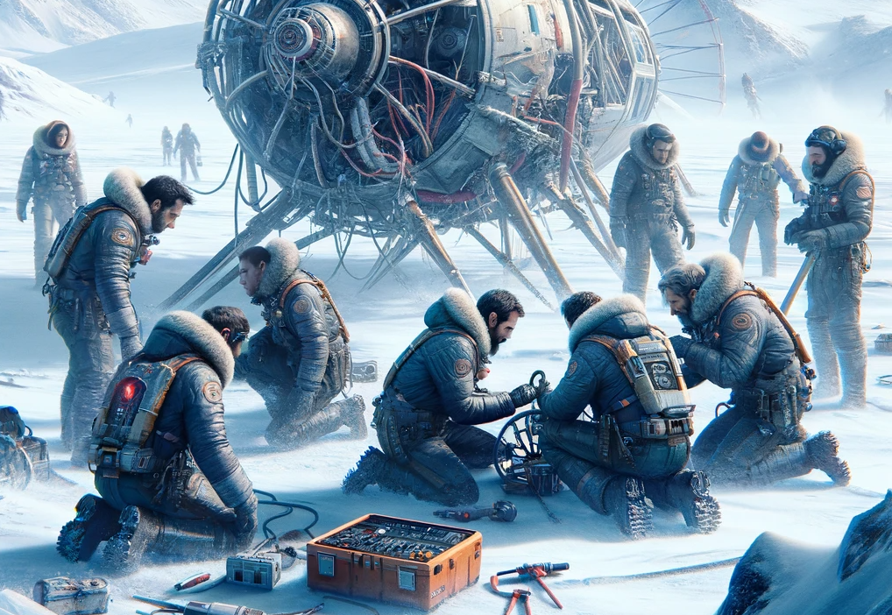

# Post-Crash: Urgent Repair Mission

## Situation Update
You find yourself in an unexpected situation. The FrostByte Flyer has crash-landed in a remote, snowy wilderness. Fortunately, the sleigh's advanced safety systems have done their job remarkably well. Everyone is safe, with only a few bumps and bruises to show for the ordeal.

## The Challenge Ahead
As the only flight engineers on board (the fully trained one sat this short flight out – not enough room, you know how it is), the responsibility to get the avionics back online falls squarely on your shoulders. It's time to turn those training sessions into action and get the FrostByte Flyer off this frozen wasteland and back to safety.

## A Race Against Time
While the conditions are calm at the moment, the weather forecast isn't looking too friendly. A severe ice storm is expected to hit in just a few hours, so you need to get the sleigh flightworthy before then. No pressure, right?

## First Steps
First things first, after activating the emergency beacon (good thing you paid attention during the initial training, eh?), it's time to reactivate the radio and call for help. Remember, every second counts. Let's get to work and bring the FrostByte Flyer back to life!

[Proceed to Radio Reactivation](/docs/challenges/jingle-bells.html){: .btn .btn-green }
