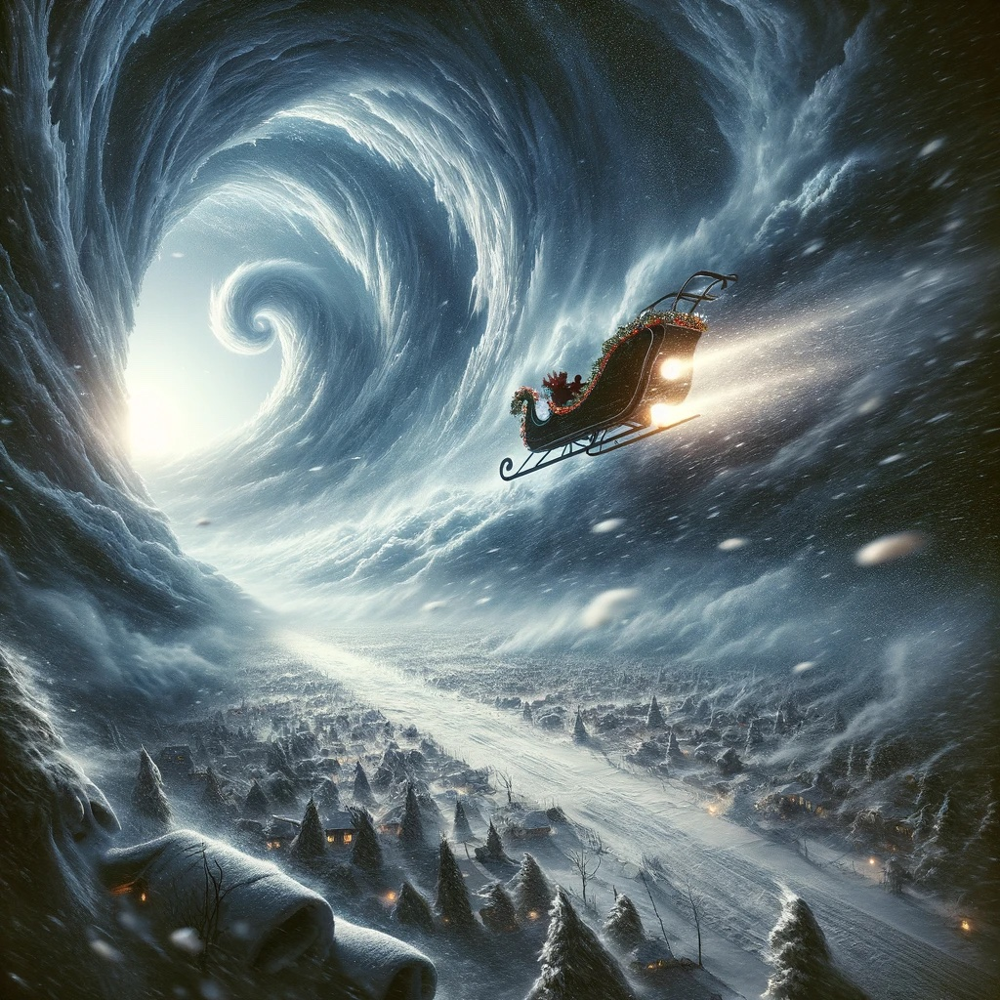

# Narrow Escape: Mission Success
In the nick of time, with the roaring ice storm on your heels, you've done it – the FrostByte Flyer is airborne again! Your swift repairs and daring efforts have snatched victory from the jaws of the Arctic tempest.

### Against All Odds
As the storm howled closer, you worked tirelessly, fixing system after system. The sleigh, battered but resilient, responded to your skilled hands, rising from the snow just as the first blasts of the blizzard struck.

### The Flight Out
With a surge of power and a whirl of snow, the FrostByte Flyer soared into the sky, leaving the storm's icy grasp behind. Your heartbeats still racing, you navigated through the tempest to the safety of clear skies.

**Congratulations on your remarkable achievement! You've not only saved the sleigh but also ensured the magic of Christmas endures. Well done, Flight Engineers!**

[Home](/)

