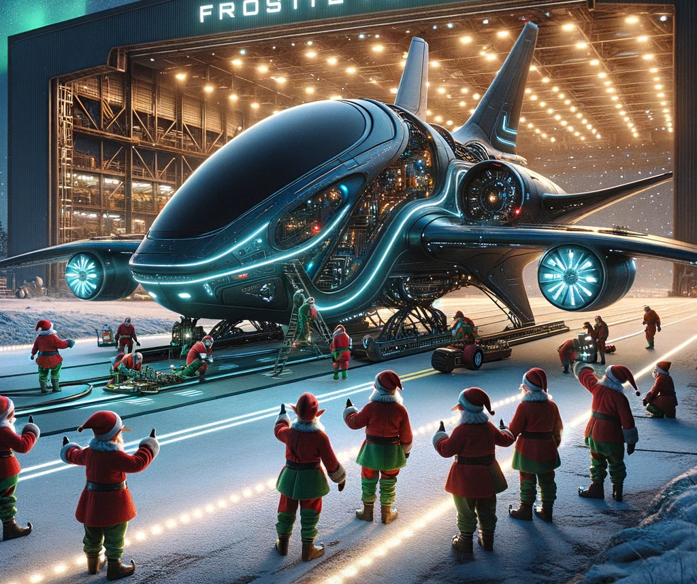

# FrostByte Flyer Demo Flight Briefing

## Mission Briefing
Welcome back, flight engineers! You've done an excellent job with your initial training. Now, it's time to put that knowledge to the test with a short demonstration flight. This routine mission is designed to let you experience the FrostByte Flyer's capabilities and to 'stretch its legs', so to speak.

## Objective
Your task is simple: embark on a brief flight around the North Pole airspace. This will be a standard, controlled loop, just to ensure all systems are functioning smoothly post-training. You'll be due to resume your advanced training upon your return.

## Flight Plan
- **Departure:** Santa’s Advanced Technology Workshop
- **Route:** North Pole Perimeter
- **Duration:** Approximately 15 minutes
- **Focus:** System Checks and Basic Maneuvering

## Pre-Flight Checklist
- Ensure all systems are fully operational.
- Double-check weather and wind conditions.
- Review basic control and emergency procedures (just as a formality).

## Note
While this flight is just a standard procedure, remember, every moment at the controls of the FrostByte Flyer is an opportunity to learn and grow as an engineer. Enjoy the flight, and see you back soon for the continuation of your training!

[Launch Mission](/launch.html){: .btn .btn-green }

