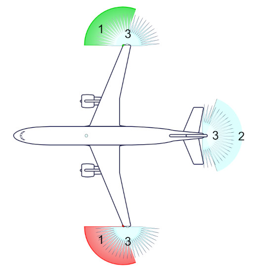

# Navigation Lights Reactivation Challenge
_Guided by the stars above, align the colors with care and love._  
_Red to port, green to starboard, steady and bright, guide this frosty night._

## Mission Briefing
The crash has damaged the FrostByte Flyer's navigation lights, essential for signaling and navigating through the harsh Arctic skies. Your task is to restore these lights by correctly configuring and programming a series of LEDs.

## The Puzzle
You find the navigation light panel with several unlit LEDs and a jumbled mess of wires. A schematic diagram is partially visible, but key information about the color sequence and wiring is missing.

## Instructions
1. Determine the correct color sequence and wiring for the LEDs based on the partial schematic and any clues found in the workshop.
2. Connect the LEDs to your Arduino board following the correct sequence and circuit design.
3. Program the Arduino to control the LEDs, simulating standard navigation light patterns.
4. Test your setup to ensure all lights function correctly and in the proper sequence.

## Resources
- [LEDs with Arduino Tutorial](../assets/files/2.1 LED.pdf)
- [Digital Inputs](../assets/files/2.3 Digital Inputs/2.3 Digital Inputs.pdf)
- [Digital Inputs Sample Code](../assets/files/2.3 Digital Inputs/Digital_Inputs/Digital_Inputs.ino)

1. Navigation lights
2. Aft Light
3. Anti-collision strobe

[Back to Challenges Overview](/challenges/)
