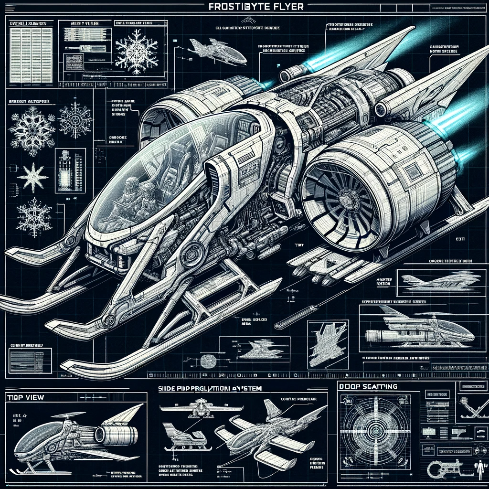

# Welcome to FrostByte Flyer Flight Engineer Training

## Introduction
Greetings, future flight engineers of the FrostByte Flyer! You're about to embark on an exciting journey into the world of Arduino, where cutting-edge technology meets the magic of the holiday season. This manual will guide you through the essential skills needed to operate the most advanced and reliable sleigh ever designed.

## Objective
Your training will equip you with the technical know-how to handle the sophisticated systems aboard the FrostByte Flyer. We'll start with the basics of Arduino and progress through the intricacies of the development environment, preparing you for any scenario... though, with the Flyer's stellar reliability record, it's unlikely you'll encounter any troubles.

## Training Modules

### Introduction to Arduino
- **Overview:** Discover the capabilities of Arduino and its vital role in powering our state-of-the-art sleigh.
- **Resource:** [Introduction to Arduino](../../assets/files/1.2 First Look Arduino.pdf)

### Setting Up the Arduino IDE
- **Overview:** Learn to set up and navigate the Arduino Integrated Development Environment. This is where you'll bring your code to life!
- **Resource:** [Arduino Development Environment (Windows)](../../assets/files/1.3 For Windows Setting up development environment.pdf)
- **Resource:** [Arduino Development Environment (Linux/Mac)](../../assets/files/1.4 For Mac and Ubuntu Building a Developed Environment.pdf)

### Understanding the Emergency Beacon: Blink Tutorial
- **Overview:** Master the Blink sketch, a fundamental exercise in Arduino programming. Technically, it’s for activating the emergency beacon, but let’s be honest, the FrostByte Flyer is so reliable, you’ll likely never need it!
- **Resource:** [Blink Tutorial and Adding Libraries](../../assets/files/1.5 Blink and Add Libraries.pdf)

### Using the Arduino Serial Monitor
- **Overview:** Learn to use the built-in Arduino Serial Monitor.
- **Resource:** [Arduino Serial Monitor](../../assets/files/2.4 Serial Monitor.pdf)

## Ready to Begin
With the completion of these initial tutorials, you'll possess the foundational skills to operate the FrostByte Flyer. Remember, while the Flyer is famed for its impeccable performance, a good engineer is always prepared for any situation.

Best of luck, engineers! You're about to become an integral part of Santa's most ambitious Christmas operation yet. There's a short demonstration flight due to take off shortly, make sure you're on it!

[Flight Briefing](/demo-flight.html){: .btn .btn-green }

[Back to Training Overview](/docs/training/)
