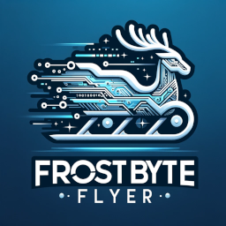

# Welcome to Santa's Advanced Technology Workshop

## FrostByte Flyer Flight Engineer Training

Greetings, aspiring engineers! You have arrived at the North Pole's pinnacle of innovation and technology – Santa's Advanced Technology Workshop. Here, the magic of Christmas meets the marvels of modern engineering, and you are about to become a part of it.

### Embark on an Unforgettable Journey
As a trainee flight engineer, you will learn to master the controls of the FrostByte Flyer, Santa's most advanced sleigh. Your training will encompass everything from basic Arduino programming to handling complex avionics systems. 

### Ready to Make Christmas Magic?
Your journey will be challenging but rewarding. You will not only gain invaluable skills but also play a crucial role in ensuring the joy and wonder of Christmas reach every corner of the globe.

[Begin Training](/docs/training/index.html){: .btn .btn-green }

**Are you ready to embark on this exciting adventure? Click 'Begin Training' to start your journey as a FrostByte Flyer Flight Engineer!**

